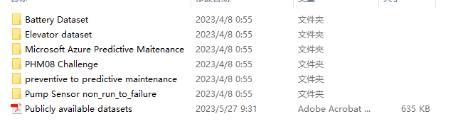
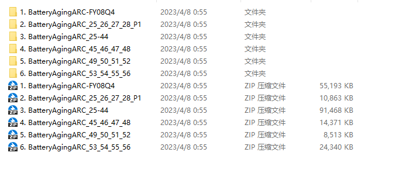

# Predictive Maintenance Dataset

Battery Dataset: The battery dataset is collected from the Internet of Things sensors in the elevator industry, used for predictive maintenance of elevator doors.
Elevator dataset: The dataset is collected from IoT sensors in the elevator industry and is used for predictive maintenance of elevator doors.
Microsoft Azure maintenance dataset: The data is composed of the hourly average values of voltage, rotation, pressure, and vibration collected from 100 machines in 2015.
PHM08 Challenge dataset: The dataset is collected from the PHM08 Challenge.
Run-To-Failure dataset: The dataset is collected from the Run-To-Failure sensor.

All code has been tested and there are no issues. Please read the project description carefully before submission as it involves different programming languages (Python or MATLAB).
This program is a special item that cannot be returned after sale. If you have any questions, please contact us in time.
This code will not be explained.

## Images

Here is a pay link on Stripe ( https://buy.stripe.com/3cs8yP7sY87d0vu9AB ). Please contact me lonlonago@foxmail.com after funding $89, and I will send you a complete data files , thank you!

